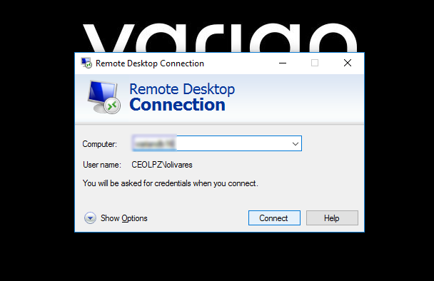
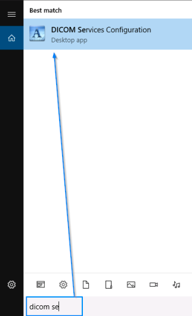
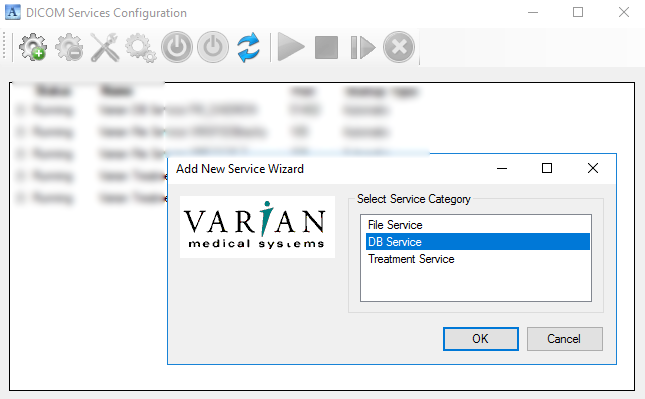
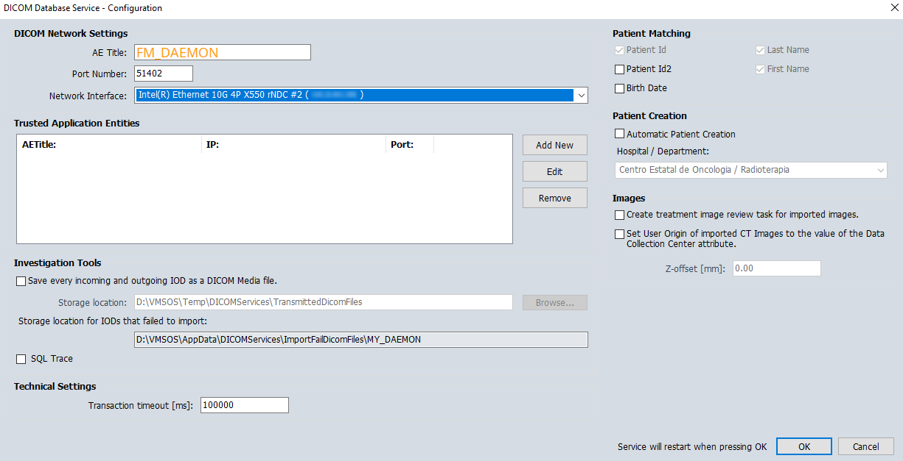
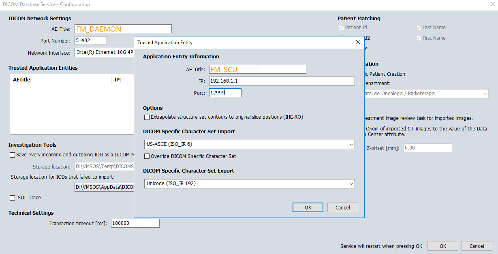
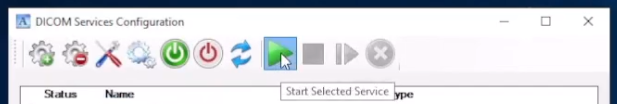
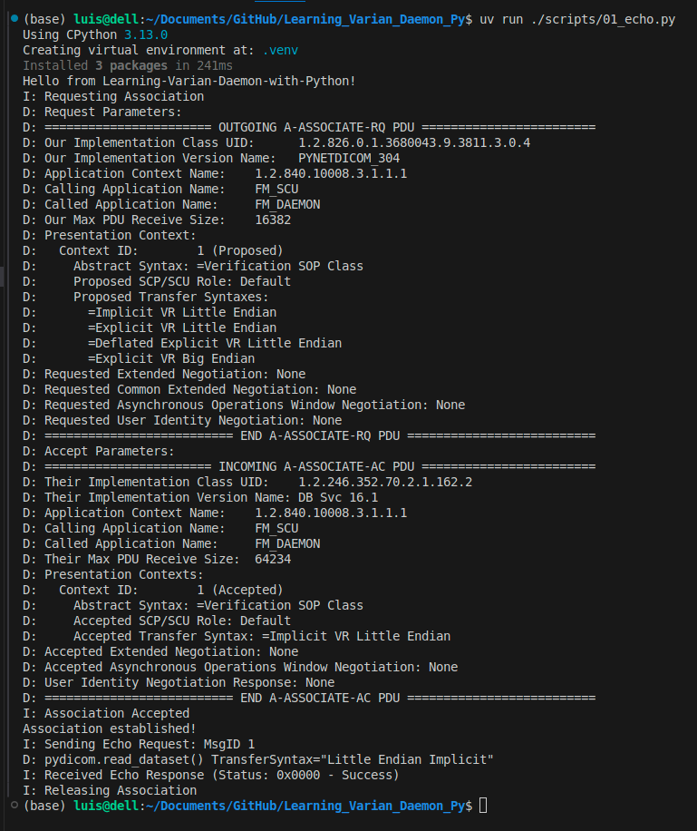

# Setting up

## 1.1 Client-side Configuration
To make requests to the Daemon, we can use any computer that is on the network. In this repository we will use a PC running Ubuntu 24.04 LTS. To install and manage Python packages, we will use the [uv](https://docs.astral.sh/uv/) package.

To connect two computers according to the DICOM protocol, the application that will make the queries (the client) must have the following:

- *Application Entity Title* (AET). We will use **FM_SCU**
- *IP Address*, which is the address of our PC on the network. We will use the address **192.168.1.1**

## 1.2 Provider-side Configuration

> [!NOTE]
> In this example we are working with Eclipse v16.0

We need to access the server that contains the database.



Once connected to the server, search and open the *DICOM Service Configuration* application. 



Add a new service (first gear icon), and select *DB Service*



In the *DICOM Database Service - Configuration window

1. Add the AE Title of the client: FM_DAEMON
2. Add a port number: 51402
3. On Network Interface, select the one with the same IP as the server.
4. Check Automatic Patient Creation



Add a new *Trusted Application Entity* with the client information we have defined previously in the Client-side configuration



On the DICOM Service Configuration window, click  on the green arrow icon to start the service.



Now, we can log out from the server.

## 1.3 Verify Connectivity
To verify that the client can connect to the Daemon service, we can use the script `01_echo.py` provided in this repository. First, make sure you have installed the required packages by running:

```bash
uv add pydicom pynetdicom
```

Then, run the echo script:

```bash
un run ./scripts/01_echo.py
```

If everything is set up correctly, you should see a message indicating that the C-ECHO request was successful.

