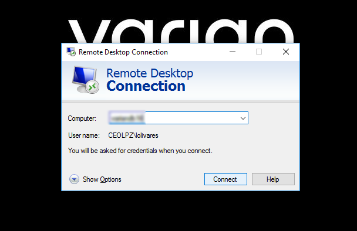
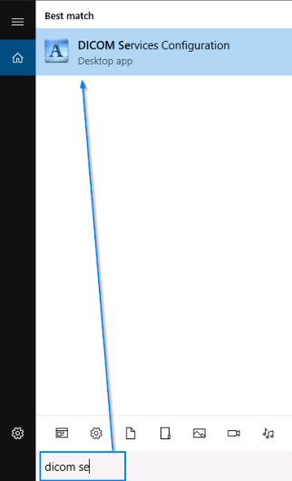
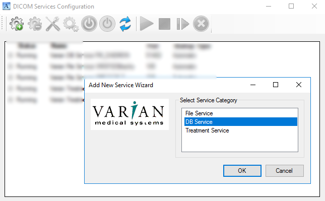
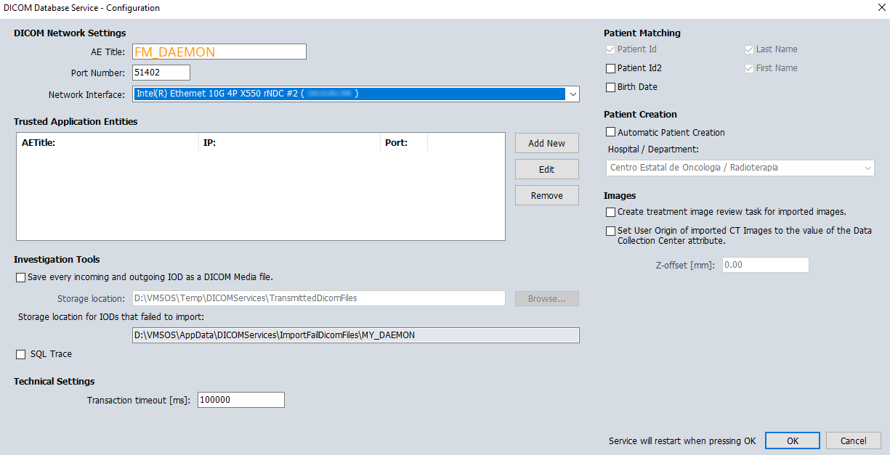
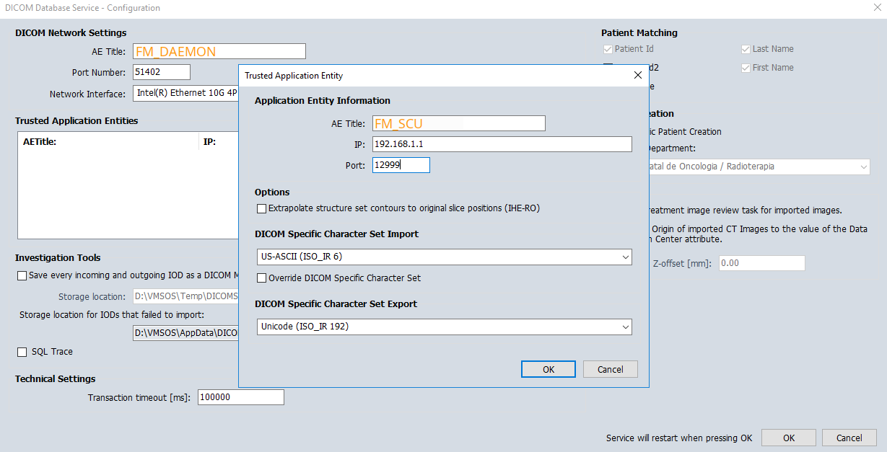
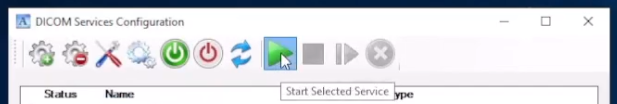
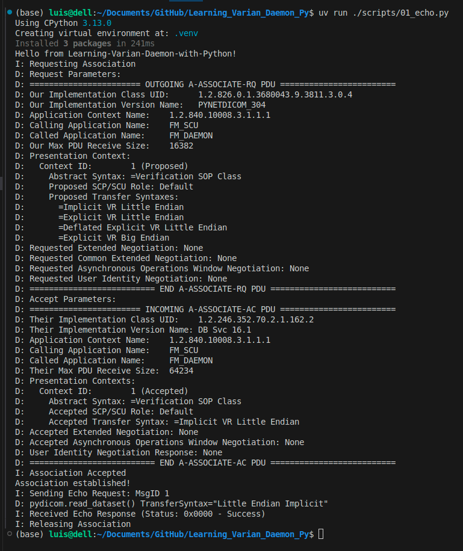

# Setting up

## 1.1 Client-side Configuration
To make requests to the Daemon, we can use any computer that is on the network. In this repository we will use a PC running Ubuntu 24.04 LTS. To install and manage Python packages, we will use [uv](https://docs.astral.sh/uv/).

To connect two computers according to the DICOM protocol, the application that will make the queries (the client) must have the following:

- *Application Entity Title* (AET). This can be any title. We will use **FM_SCU**
- *IP Address*, this is the address of our PC on the network. We will use the address **192.168.1.1**

> [!TIP]
> In programming it is a good practice to avoid hardcoding sensitive information such as IP addresses, ports, and AE Titles directly into the code. Instead, we can use environment variables to store this information securely and access it within our scripts.

Inside the root folder of this respository, create a file named `.env` and add the following variables:

```
DAEMON_AE_TITLE="FM_DAEMON"
DAEMON_IP="YOUR_DAEMON_IP_ADDRESS"
DAEMON_PORT="51402"

PYNETDICOM_AE_TITLE="FM_SCU"
PYNETDICOM_IP="192.168.1.1"
PYNETDICOM_PORT="12999"
```

> [!NOTE]
> Replace `YOUR_DAEMON_IP_ADDRESS` and `192.168.1.1` with the actual IP addresses of the Daemon server and the Python client respectively. More about this below.

## 1.2 Provider-side Configuration

> [!WARNING]
> Wrong configurations on the server may lead to connectivity issues. Please ensure you have the necessary permissions and follow the steps carefully.

> [!NOTE]
> In this example we are working with Eclipse v16.0

We need to access the server that contains the database. You can use Remote Desktop Connection to connect to the server. Use the credentials provided by your network administrator.



Once connected to the server, search and open the *DICOM Service Configuration* application. 



Add a new service (first gear icon), and select *DB Service*



In the *DICOM Database Service - Configuration window

1. Add the AE Title of the client: FM_DAEMON
2. Add a port number: 51402
3. On Network Interface, select the one with the same IP as the server.
4. Check Automatic Patient Creation



Add a new *Trusted Application Entity* with the client information we have defined previously in the Client-side configuration



On the DICOM Service Configuration window, click  on the green arrow icon to start the service.



Now, we can log out from the server.

## 1.3 Verify Connectivity
To verify that the client can connect to the Daemon service, we can use the script `01_echo.py` provided in this repository. First, make sure you have installed the required packages by running:

```bash
uv add pydicom pynetdicom
```

Then, run the echo script:

```bash
un run ./scripts/01_echo.py
```

If everything is set up correctly, you should see a message indicating that the C-ECHO request was successful.

